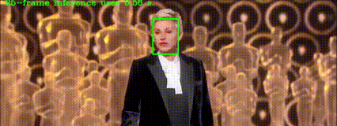

# Fast-Face-Alignment
## Intrduction
We provide several small models for face alignment, which have shown good performances on both AFLW2000-3D and 300W-LP.
We will realse the method introdutuon and training code later.

## Model information

Model| #parm |NME on AFLW2000-3D|NME on 300WLP
------|--------|----------|--------
Our small model |3.64M    |0.0189     | 0.0336

Much more models will be released sooner.

## Requirments
* Python 3.7 
* Linux, or Windows 
* pytorch
* numpy

# Acknowledgements
* The code is based on [face alignment](https://github.com/1adrianb/face-alignment), we implemented our ideas with some changes.
* The face detector used in our code is implenmented by [Linzaer](https://github.com/Linzaer/Ultra-Light-Fast-Generic-Face-Detector-1MB).
